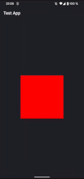

# ti.viewanimation


<br/>

Using [AndroidViewAnimations](https://github.com/daimajia/AndroidViewAnimations) in Titanium

## Example

```js
const VIEW_ANIMATION = require("ti.viewanimation");
const win = Ti.UI.createWindow();
const view = Ti.UI.createView({
	width: 200,
	height: 200,
	backgroundColor: "red"
});

win.add(view);
win.addEventListener("open", function(e) {
	VIEW_ANIMATION.animate({
		view: view,
		type: VIEW_ANIMATION.RUBBERBAND,
		duration: 500,
		repeat: 1
	});
})

win.open();
```

## Constants

use the following animation type constants:

* FLASH
* PULSE
* RUBBERBAND
* SHAKE
* SWING
* WOBBLE
* BOUNCE
* TADA
* STANDUP
* WAVE
* HINGE
* ROLLIN
* ROLLOUT
* LANDING
* TAKINGOFF
* DROPOUT
* BOUNCEIN
* BOUNCEINDOWN
* BOUNCEINLEFT
* BOUNCEINRIGHT
* BOUNCEINUP
* FADEIN
* FADEINUP
* FADEINDOWN
* FADEINLEFT
* FADEINRIGHT
* FADEOUTDOWN
* FADEOUTLEFT
* FADEOUTRIGHT
* FADEOUTUP
* FLIPINX
* FLIPOUTX
* FLIPOUTY
* ROTATEIN
* ROTATEINDOWNLEFT
* ROTATEINDOWNRIGHT
* ROTATEINUPLEFT
* ROTATEINUPRIGHT
* ROTATEOUTDOWNLEFT
* ROTATEOUTDOWNRIGHT
* ROTATEOUTUPLEFT
* ROTATEOUTUPRIGHT
* SLIDEINLEFT
* SLIDEINRIGHT
* SLIDEINUP
* SLIDEINDOWN
* SLIDEOUTLEFT
* SLIDEOUTRIGHT
* SLIDEOUTUP
* SLIDEOUTDOWN
* ZOOMIN
* ZOOMINDOWN
* ZOOMINLEFT
* ZOOMINRIGHT
* ZOOMINUP
* ZOOMOUTDOWN
* ZOOMOUTLEFT
* ZOOMOUTRIGHT
* ZOOMOUTUP
